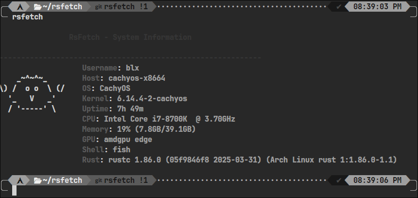

# RSFETCH
RSFETCH IS RETRY OF MY PYFETCH BUT NOW RUSTED
IT MIGHT BE SLOWLY AS HELL BUT IM PLANING IMPROVE MORE AND MORE

# INSTALL
INSTALL **CARGO** FOR BUILD

```
git clone https://github.com/binarylinuxx/rsfetch
cd rsfetch
cargo build --release
```

RUN
```
./target/release/rsfetch
```
ENJOY!

# EXAMPLE SCREENSHOT

